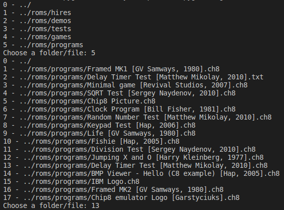

# CHIP8-Emulator

This is a Chip8 emulator done with Python 3.6 and Pygame.
This project is divided in several modules for a better organization.

## Installation

    pip3 install -r requirements.txt
    
## How to Use
You can you use the build-in CLI to select the rom or the terminal.

Terminal:
    
    python3 main.py path/to/rom

Built-in CLI

## CPU
The CPU module as the variables

PC     : Program Counter - The current address memory
I      : The address register
Opcode : The opcode that will be executed by the CPU

Delay timer: This timer is intended to be used for timing the events of games
Sound timer: This timer is used for sound effects

The CPU as the methods

Cycle:  Reponsible to do emulate a single cpu cycle
Decode: Executes the requested opcode

The complete opcode list can be accessed in [link](https://en.wikipedia.org/wiki/CHIP-8).

## Memory

### RAM
The Chip8 has 4KB of memory, 4096 memory locations of 8 bits.
The first 512 addresses are reserved to the Chip8 interpreter so the programs start at the location 
0x200 (the default value of _PC_).

    +----------------+= 0xFFF End of Chip-8 RAM
    |                |
    |                |
    | 0x200 to 0xFFF |
    | Chip-8 Program |
    |                |
    |                |
    +----------------+= 0x200 Start of most Chip-8 programs
    | Reserved for   |
    |  interpreter   |
    +----------------+= 0x000 Start of Chip-8 RAM

Diagram based on the [Cowgod's Chip-8 Technical Reference v1.0](http://devernay.free.fr/hacks/chip8/C8TECH10.HTM)

### Registers
Chip8 as 16 8 bit registers, V0 to VF.

VF is used for flags, carry, not borrow, etc.

Along with the **registers**, there is also a **Stack** used to keep track of the return locations during a function calling.

## Input

The Chip8 Input is done via a 16 key keyboard with the hexadecimal codes from 0x0 to 0xF.

The diagram bellow relates the used keys to their hexadimal codes.
    
    
    +---+---+---+---+     +---+---+---+---+
    |0x1|0x2|0x3|0xC|     | 1 | 2 | 3 | 4 |
    +---+---+---+---+     +---+---+---+---+
    |0x4|0x5|0x6|0xD|     | Q | W | E | R | 
    +---+---+---+---+  >> +---+---+---+---+ 
    |0x7|0x8|0x9|0xE|     | A | S | D | F | 
    +---+---+---+---+     +---+---+---+---+
    |0xA|0x0|0xB|0xF|     | Z | X | C | V |
    +---+---+---+---+     +---+---+---+---+
    
## Sound

Chip8 supports only a beep that is played when the _sound timer_ reaches zero.

## Display

Chip8 has a monochromatic 64 by 32 pixels display.

    (0,0)           (63, 0)     
    +---------------------+
    |                     |
    |                     |
    |                     |
    +---------------------+
    (31, 0)        (63, 32)
    
## Todo

Add support for the Super Chip (CHip 48).

## References

- http://devernay.free.fr/hacks/chip8/C8TECH10.HTM
- https://en.wikipedia.org/wiki/CHIP-8
